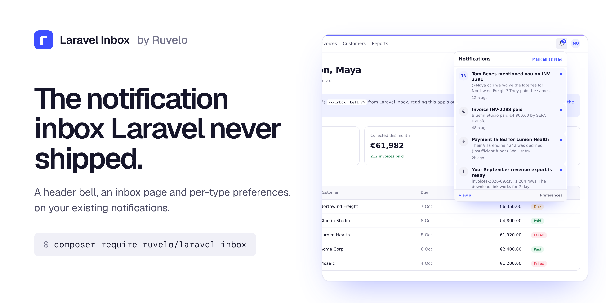
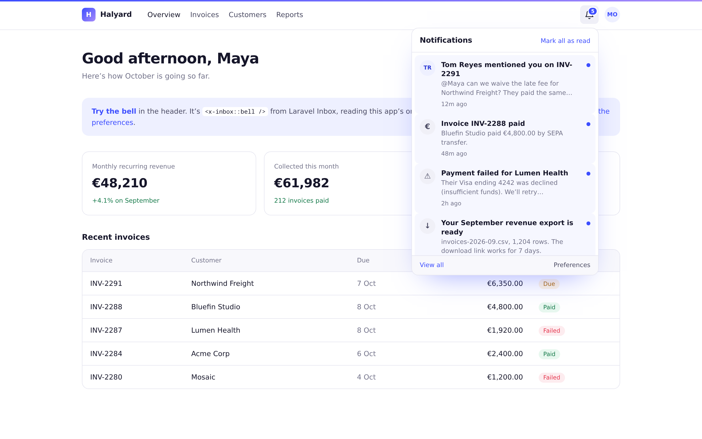
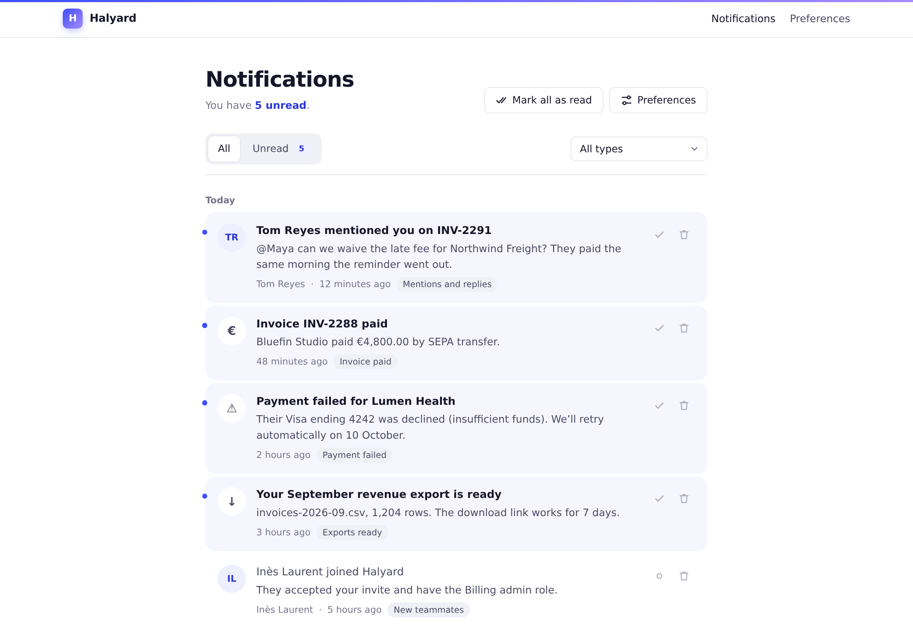
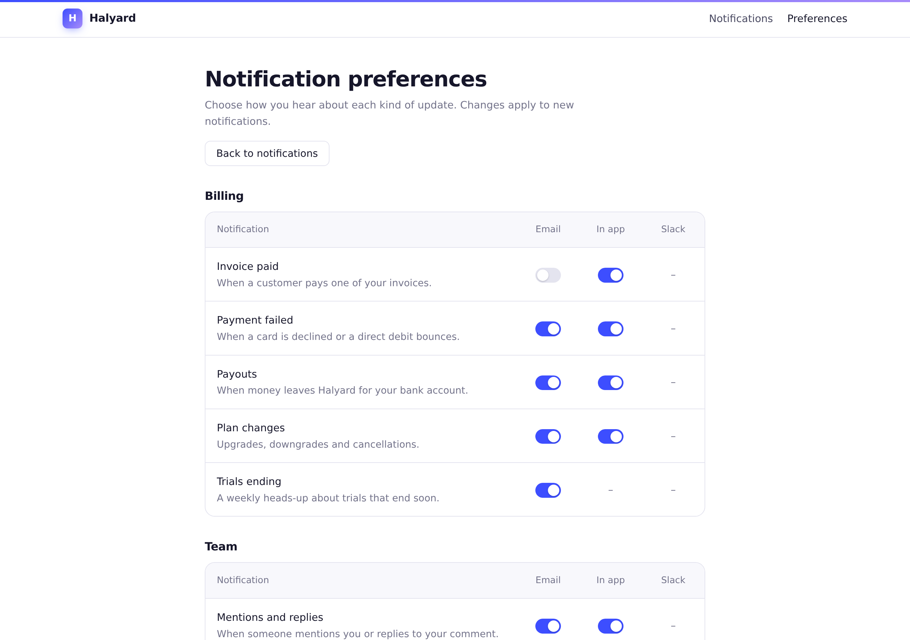
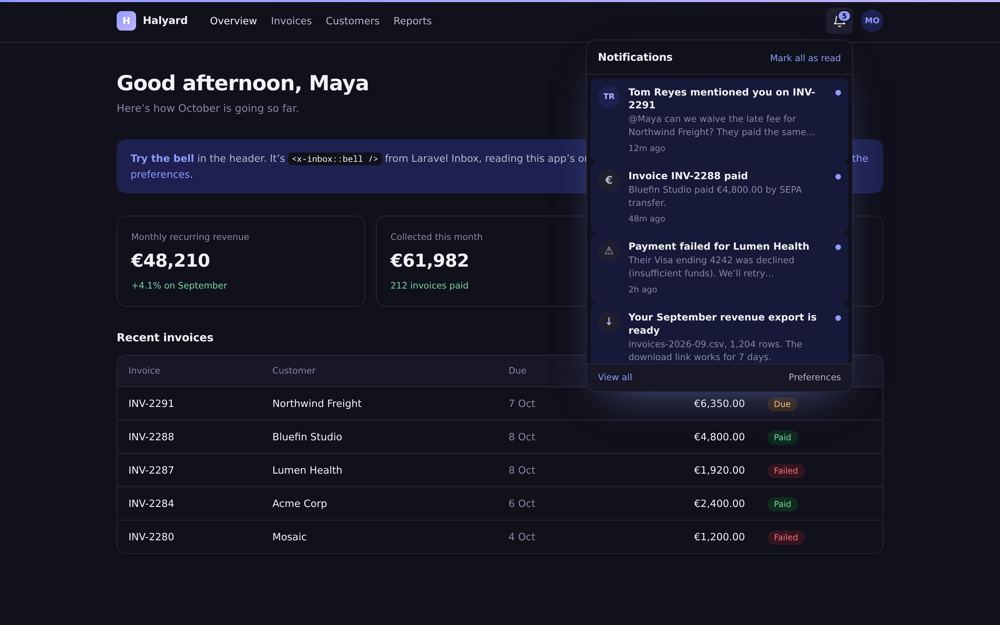
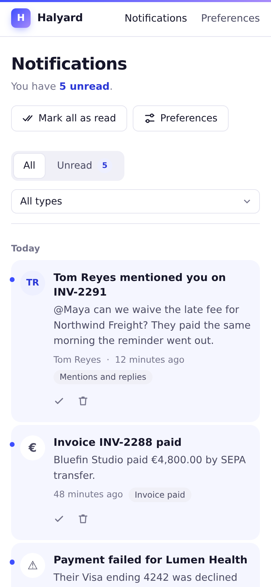

<p align="center">
  <a href="https://ruvelo.github.io/laravel-inbox/"></a>
</p>

<p align="center">
  <a href="https://ruvelo.github.io/laravel-inbox/"><strong>Live demo</strong></a> &nbsp;&nbsp;&nbsp;
  <a href="#configuration"><strong>Configuration</strong></a> &nbsp;&nbsp;&nbsp;
  <a href="#for-developers"><strong>Developer guide</strong></a> &nbsp;&nbsp;&nbsp;
  <a href="CHANGELOG.md"><strong>Changelog</strong></a>
</p>

<p align="center">
  <a href="https://github.com/Ruvelo/laravel-inbox/actions/workflows/tests.yml"></a>
  
  
  
  <a href="LICENSE"></a>
</p>

# Laravel Inbox

**The in-app notification inbox Laravel never shipped.** A bell for your header, an inbox page, and per-type preferences, built on Laravel's own `database` notification channel. The notifications you already send show up as they are: no new table for them, no changes to your classes, no frontend build step.

```
composer require ruvelo/laravel-inbox
php artisan migrate
```

Then put `<x-inbox::bell />` in your header. Or click around the [live demo](https://ruvelo.github.io/laravel-inbox/) first.

## A quick tour



**A bell for your header.** One Blade tag. It shows the unread count, and opens on the latest notifications. Opening one marks it read in the background and takes you straight to it. The count keeps itself up to date while the tab is open, and updates instantly if your app uses Laravel Echo.



**An inbox page for everything else.** All and Unread tabs, notifications grouped by day, a filter by type, and mark read, mark unread and delete on every item.



**Preferences people can set themselves.** Each notification type, each channel, one switch. Your notifications' `via()` respects them with one line.

<table>
  <tr>
    <td width="50%"></td>
    <td width="50%"></td>
  </tr>
  <tr>
    <td><strong>Light and dark</strong>, following each person's system setting (or your app's <code>data-theme</code> / <code>.dark</code>).</td>
    <td><strong>Made for phones too</strong>, with the actions always in reach.</td>
  </tr>
</table>

## Features

- **Zero changes to existing notifications.** Anything you send through the `database` channel appears. By convention, `toArray()` / `toDatabase()` returns `title`, `body`, `url`, and optionally `icon` (an emoji or a short string) and `actor` (a name). Other shapes still show, titled after the class: `InvoicePaidNotification` becomes "Invoice paid".
- **`<x-inbox::bell />`**: unread badge (capped at 99+), a dropdown with the latest notifications, "Mark all as read", "View all" and "Preferences". Without JavaScript it's a link to the inbox. With it: an accessible dropdown (`aria-expanded`, Esc to close, focus moves in and back), read marks sent in the background, a polled unread count that pauses while the tab is hidden, and live updates over Laravel Echo when `window.Echo` exists.
- **The inbox page** at `/inbox`: All and Unread tabs, grouped by Today, Yesterday and dates in your app's timezone, filter by type, mark read or unread, delete, mark all as read, pagination and helpful empty states. Clicking an item marks it read and follows its link, through a plain redirect that works without JavaScript.
- **Preferences** at `/inbox/preferences`: per notification type, people switch channels on and off. Types have labels, descriptions, groups, per-channel defaults, and can be required (shown, but always on).
- **`RespectsInboxPreferences`**: one trait, one line in `via()`.
- **A JSON API** for React, Vue and Inertia, over the session: only ever the signed-in user's own notifications.
- **Safe by default**: everything is escaped, links are only ever `http(s)` or paths (`javascript:` URLs in stored data are dropped), and someone else's notification is a 404 on every route.
- **Cheap**: the unread count is one indexed `COUNT` query, and the bell runs two queries however many notifications there are.
- **Fits in**: the bell's styles are scoped and included once, so they can't touch your CSS. The pages can use your app's layout.

## Requirements

- PHP 8.3+
- Laravel 12 or 13
- The `notifications` table: `php artisan make:notifications-table` if you don't have it yet
- A notifiable model that uses Laravel's `Notifiable` trait (usually `User`)

## Using it

Put the bell in your layout, wherever your header is:

```blade
<header>
    …
    <x-inbox::bell />
</header>
```

It renders nothing for guests. Options: `<x-inbox::bell :limit="8" :poll="60" label="Updates" class="ms-auto" />`, and `:user="$someone"` to show another notifiable than the signed-in user.

Send notifications as you already do, with a `title`, `body` and `url`:

```php
class InvoicePaid extends Notification
{
    public function via(object $notifiable): array
    {
        return ['mail', 'database'];
    }

    public function toArray(object $notifiable): array
    {
        return [
            'title' => "Invoice {$this->invoice->number} paid",
            'body' => "{$this->invoice->customer} paid {$this->invoice->total}.",
            'url' => route('invoices.show', $this->invoice),
            'icon' => '💸',
        ];
    }
}
```

That's all. `subject`, `message` and `action_url` work too, if that's what your notifications already use.

### Describing a notification in code

Implement `InboxNotification` and the inbox stores your message with the notification; you don't need `toArray()`:

```php
use Ruvelo\Inbox\Contracts\InboxNotification;
use Ruvelo\Inbox\InboxMessage;

class TeammateJoined extends Notification implements InboxNotification
{
    public function via(object $notifiable): array
    {
        return ['database'];
    }

    public function toInbox(object $notifiable): InboxMessage
    {
        return InboxMessage::make("{$this->user->name} joined your team")
            ->withUrl(route('team'))
            ->withActor($this->user->name);
    }
}
```

Or decide how a type looks without touching it (handy for notifications from other packages, or ones already in the database):

```php
Inbox::present(ExportReady::class, fn (array $data) => InboxMessage::make(
    'Your export is ready',
    body: "{$data['rows']} rows",
    url: route('exports.show', $data['export_id']),
    icon: '📦',
));
```

### Preferences

Register the types people can switch, in `config/inbox.php` or a service provider:

```php
use Ruvelo\Inbox\Inbox;

Inbox::preferences([
    InvoicePaid::class => [
        'label' => 'Invoice paid',
        'description' => 'When a customer pays one of your invoices.',
        'group' => 'Billing',
        'channels' => ['mail', 'database'],
        'defaults' => ['mail' => false],   // off until they turn it on
    ],
    SecurityAlert::class => [
        'label' => 'Security alerts',
        'channels' => ['mail'],
        'required' => true,                // shown, can't be turned off
    ],
]);
```

Then let the notification respect them:

```php
use Ruvelo\Inbox\Notifications\RespectsInboxPreferences;

class InvoicePaid extends Notification
{
    use RespectsInboxPreferences;

    public function via(object $notifiable): array
    {
        return $this->preferredChannels($notifiable, ['mail', 'database']);
    }
}
```

Channels that aren't listed for a type, unregistered types, required types and on-demand notifiables (`Notification::route(...)`) always get through. To share one switch between several notifications, override `inboxType()` to return the same key. Choices live in their own table, one row per explicit choice; everything else follows the type's default.

### Who sees what

Every route needs a signed-in user and only ever shows or changes that user's own notifications. Anyone else's notification is a 404, never a 403, so ids can't be probed. Guests are sent to your `login` route, or get a 403 in an app that doesn't have one yet (a fresh install before a starter kit), so you don't need `auth` in the middleware, though it's fine to add it.

## Configuration

Publish the config file if you want to change the defaults:

```
php artisan vendor:publish --tag=inbox-config
```

| Key | Default | |
|---|---|---|
| `path` | `inbox` (`INBOX_PATH`) | URL prefix for the inbox and preferences pages |
| `domain` | `null` | Serve them on their own (sub)domain |
| `middleware` | `['web']` | Applied to every page; signing in is always required |
| `routes` | `true` | Set to `false` to register routes yourself (copy `routes/web.php`) |
| `api.enabled` | `true` (`INBOX_API`) | The JSON API |
| `api.prefix` | `api/inbox` | Where the JSON API lives |
| `api.middleware` | `['web']` | Session authentication: keep `web`, or use your own guard |
| `layout` | `null` | Your layout view for the pages; `null` uses the package's own |
| `section` | `content` | The section of your layout the pages fill |
| `bell.limit` | `6` | How many notifications the dropdown shows |
| `bell.poll` | `30` | Seconds between unread-count checks; `0` turns polling off |
| `bell.echo` | `true` | Listen on the user's private channel when Laravel Echo is on the page |
| `per_page` | `25` | Notifications per page on the inbox |
| `timezone` | your app's | Timezone for "Today", "Yesterday" and dates |
| `preferences` | `[]` | Notification types people can switch on and off |
| `channels` | `database` → In app, `mail` → Email… | How channels are labelled on the preferences page |
| `notifications_table` | `notifications` | Laravel's notifications table |
| `table_prefix` | `inbox_` | The preferences table is `{prefix}preferences` |
| `run_migrations` | `true` | Set to `false` if you publish the migration and run it yourself (`--tag=inbox-migrations`) |

## Making it look like your app

The colours are CSS variables, scoped to the bell and the pages, using the Ruvelo house style. Override any of them in your own CSS:

```css
.inbox-bell, .inbox-page { --inbox-accent: #0e7c66; --inbox-accent-soft: #e6f5f1; }
```

To put the inbox and preferences pages inside your app's chrome, point `layout` at your layout. The pages fill the `section` you name (and a `title` section), and bring their own scoped styles:

```php
'layout' => 'layouts.app',
'section' => 'content',
```

For full control, publish the views. They land in `resources/views/vendor/inbox`:

```
php artisan vendor:publish --tag=inbox-views
```

## For developers

### PHP API

```php
use Ruvelo\Inbox\Inbox;

Inbox::unreadCount($user);              // one indexed COUNT query
Inbox::latest($user, 5);                // newest first, read or not
Inbox::query($user)->whereNull('read_at')->paginate();
Inbox::find($user, $id);                // null if it isn't theirs
Inbox::markRead($notification);         // false if it already was
Inbox::markUnread($notification);
Inbox::markAllRead($user);              // one query; returns how many
Inbox::delete($notification);
Inbox::message($notification);          // how it looks: an InboxMessage
Inbox::present(Type::class, fn (array $data, Notification $n) => InboxMessage::make('…'));
Inbox::preferences([...]);              // register switchable types
Inbox::wants($user, InvoicePaid::class, 'mail');
Inbox::filterChannels($user, InvoicePaid::class, ['mail', 'database']);
Inbox::preferencesFor($user);           // [type => [channel => bool]], defaults filled in
Inbox::updatePreferences($user, [InvoicePaid::class => ['mail' => true]]);
```

The write methods accept Laravel's own `DatabaseNotification` (what `$user->notifications` returns) as well as the package's `Ruvelo\Inbox\Models\Notification`, which reads the same table and adds `message()`, `isUnread()` and the `ownedBy($user)` scope.

`InboxMessage` is a small immutable value object: `make($title, $body, $url, $icon, $actor)`, `with…()` methods that return copies, `initials()`, `excerpt()` and `toArray()`.

### JSON API

For React, Vue and Inertia front ends. It runs on the session (`web` middleware), so send the CSRF token on writes as you would for any form, and only ever touches the signed-in user's own notifications. Paths are relative to `/api/inbox`.

| Request | Does |
|---|---|
| `GET /notifications` | List, newest first. `?filter=unread`, `?type=<class>`, `?per_page=` up to 100. `meta.unread` and `meta.types` included |
| `GET /notifications/count` | `{"unread": 3}`: cheap enough to poll |
| `GET /notifications/{id}` | One notification |
| `POST /notifications/{id}/read` | Mark read; returns the notification |
| `POST /notifications/{id}/unread` | Mark unread; returns the notification |
| `POST /notifications/read-all` | `{"marked": 3, "unread": 0}` |
| `DELETE /notifications/{id}` | Delete. `204` |
| `GET /preferences` | Every registered type with its label, description, group, `required` and `channels: {mail: true, …}` |
| `PUT /preferences` | `{"preferences": {"App\\Notifications\\InvoicePaid": {"mail": false}}}`; only the pairs sent change. `422` for unknown types or channels, or for turning off a required type |

A notification looks like this:

```json
{
  "id": "9d1c…", "type": "App\\Notifications\\InvoicePaid", "type_label": "Invoice paid",
  "title": "Invoice INV-2288 paid", "body": "Bluefin Studio paid €4,800.00.", "url": "/invoices/INV-2288",
  "open_url": "https://app.test/inbox/9d1c…/open", "icon": "💸", "actor": null, "initials": "I",
  "read": false, "read_at": null, "created_at": "2026-10-08T09:12:00+00:00",
  "time_ago": "48 minutes ago", "day": "Today", "payload": { "…": "the stored data" }
}
```

Someone else's notification is a `404`; a guest gets a `401`.

### Web routes

| | |
|---|---|
| `GET /inbox` | The inbox (`?filter=unread`, `?type=`) |
| `GET /inbox/preferences`, `PUT /inbox/preferences` | Preferences |
| `GET /inbox/{id}/open` | Mark read and follow the link |
| `POST /inbox/{id}/read`, `/unread`, `DELETE /inbox/{id}` | One notification; answers JSON when asked for it |
| `POST /inbox/read-all` | Mark everything read |
| `GET /inbox/count`, `GET /inbox/bell` | What the bell polls, and its list as HTML |

### Events

| Event | When |
|---|---|
| `NotificationRead` | A notification was marked read, one at a time or by opening it |
| `NotificationUnread` | A read notification was marked unread |
| `AllNotificationsRead` | Someone marked everything read; has `notifiable` and `count` |
| `NotificationDeleted` | A notification was deleted |
| `PreferencesUpdated` | Someone changed their preferences; has `notifiable` and the `changes` |

All in `Ruvelo\Inbox\Events`, and only fired when something actually changed.

### Exceptions

`UnknownPreference` (a type or channel that isn't registered), `RequiredPreference` (turning off a required type) and `InvalidPreferenceType` (a malformed registration), all extending `Ruvelo\Inbox\Exceptions\InboxException`.

### In your tests

```php
use Ruvelo\Inbox\Models\Notification;

Notification::factory()->to($user)->count(3)->create();
Notification::factory()->to($user)->read()->ofType(InvoicePaid::class)
    ->message(InboxMessage::make('Invoice paid', url: '/invoices/1'))->create();
```

## Contributing

Pull requests are welcome. Clone, `composer install`, then `composer check` runs code style (Pint), static analysis (PHPStan level 8) and the tests, exactly as CI does. See [CONTRIBUTING.md](CONTRIBUTING.md) and the [changelog](CHANGELOG.md).

The demo and screenshots are built from the package itself: `composer demo` writes the static demo into `build/`, and `demo/screenshots.sh` regenerates `art/`.

## Credits

Built by [François Bultez](https://github.com/francoisbultez) at [Ruvelo](https://github.com/Ruvelo), and everyone who [contributes](https://github.com/Ruvelo/laravel-inbox/graphs/contributors).

## License

MIT. See [LICENSE](LICENSE).
